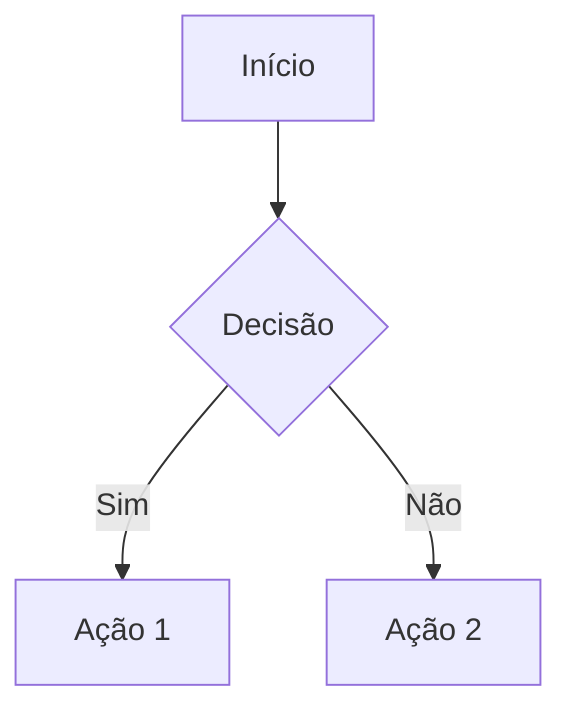
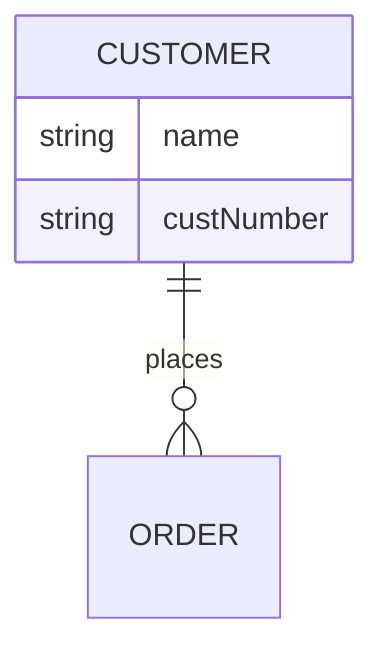
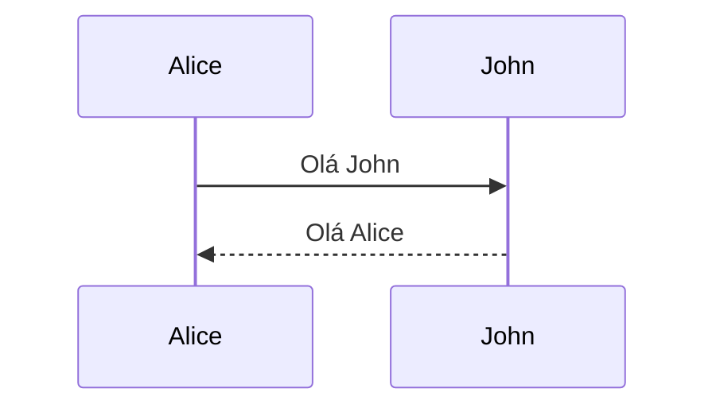

# Diagramas do Simulador Financeiro

Este diretório contém os diagramas técnicos da aplicação em formato Mermaid (.mmd).

## Arquivos Disponíveis

### 1. `data-flow-diagram.mmd`
**Diagrama de Fluxo de Dados (DFD)**
- Mostra como os dados circulam entre processos e armazenamento
- Identifica os 7 processos principais da aplicação
- Mapeia as 7 tabelas do banco de dados
- Exibe os relacionamentos e fluxos de dados

### 2. `entity-relationship-diagram.mmd`
**Diagrama Entidade-Relacionamento (ERD)**
- Apresenta o modelo de dados completo
- Define todos os campos de cada tabela
- Mostra relacionamentos (cardinalidade)
- Identifica chaves primárias e estrangeiras

### 3. `sequence-diagram-create-simulation.mmd`
**Diagrama de Sequência - Criação de Simulação**
- Ilustra o fluxo temporal de criação de uma versão
- Mostra interações entre UI, Database e Sistema de Cálculo
- Documenta queries e operações críticas

## Como Usar

### Opção 1: Mermaid Live Editor (Online) ⭐ Recomendado

1. Acesse: https://mermaid.live/
2. Cole o conteúdo do arquivo .mmd no editor
3. O diagrama será renderizado automaticamente
4. Exporte como PNG, SVG ou PDF usando os botões no canto superior direito

### Opção 2: Draw.io / Diagrams.net

1. Acesse: https://app.diagrams.net/
2. Vá em **File** → **Import from** → **Text (Mermaid)**
3. Cole o conteúdo do arquivo .mmd
4. Edite e exporte conforme necessário

### Opção 3: Visual Studio Code

1. Instale a extensão: **Markdown Preview Mermaid Support**
2. Abra o arquivo .mmd no VS Code
3. Use `Ctrl+Shift+V` (ou `Cmd+Shift+V` no Mac) para preview
4. Clique direito no preview → **Export to Image**

### Opção 4: GitHub

1. Crie um arquivo Markdown (.md)
2. Insira o conteúdo dentro de um bloco de código:

\`\`\`mermaid
[cole o conteúdo do .mmd aqui]
\`\`\`

3. GitHub renderizará automaticamente o diagrama

### Opção 5: Ferramentas CLI

**Mermaid CLI:**
```bash
npm install -g @mermaid-js/mermaid-cli
mmdc -i data-flow-diagram.mmd -o data-flow-diagram.png
```

**Playwright (usado pelo Mermaid CLI):**
```bash
npx @mermaid-js/mermaid-cli -i data-flow-diagram.mmd -o output.svg
```

## Formato de Exportação

Todas as ferramentas acima suportam exportação para:
- **PNG**: Melhor para documentação e apresentações
- **SVG**: Vetorial, ideal para zoom e edição
- **PDF**: Pronto para impressão

## Edição dos Diagramas

Para editar os diagramas:
1. Modifique os arquivos .mmd com um editor de texto
2. Use a sintaxe Mermaid: https://mermaid.js.org/intro/
3. Valide no Mermaid Live Editor antes de salvar

## Sintaxe Mermaid - Referência Rápida

### Tipos de Diagramas Disponíveis
- `flowchart`: Fluxo de dados
- `erDiagram`: Entidade-relacionamento
- `sequenceDiagram`: Diagramas de sequência
- `classDiagram`: Diagrama de classes
- `stateDiagram`: Máquina de estados
- `gantt`: Cronograma de projeto

### Exemplos de Sintaxe

**Fluxo:**


**ER:**


**Sequência:**


## Integração com Documentação

Os diagramas podem ser incorporados diretamente no arquivo `REQUISITOS.md` usando blocos de código Mermaid:

\`\`\`mermaid
[conteúdo do diagrama]
\`\`\`

## Manutenção

Quando o modelo de dados ou fluxos mudarem:
1. Atualize os arquivos .mmd correspondentes
2. Re-exporte as imagens se necessário
3. Atualize a documentação em REQUISITOS.md

## Links Úteis

- [Mermaid Documentation](https://mermaid.js.org/)
- [Mermaid Live Editor](https://mermaid.live/)
- [Mermaid Cheat Sheet](https://jojozhuang.github.io/tutorial/mermaid-cheat-sheet/)
- [Draw.io Mermaid Plugin](https://github.com/jgraph/drawio/discussions/2260)

---

**Última Atualização**: 2025
